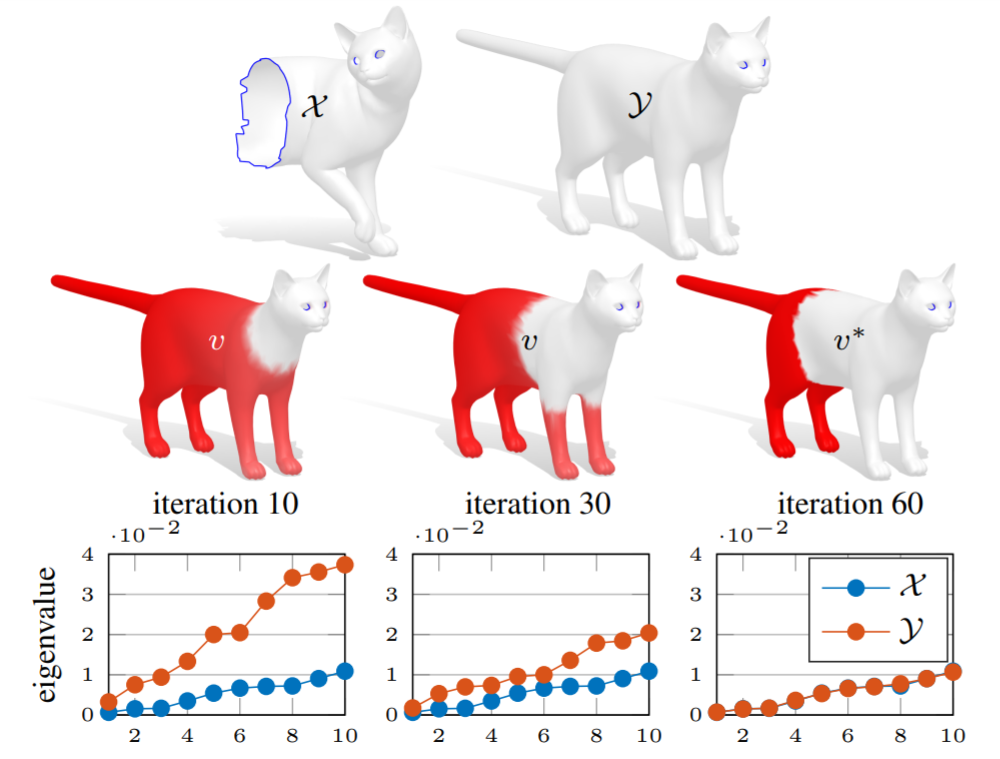

# Hamiltonian Spectrum Alignment for partial shape similarity [[Paper]](https://arxiv.org/abs/1906.06226)

This repository is the MATLAB implementation of the paper:

**Correspondence-Free Region Localization for Partial Shape Similarity via Hamiltonian Spectrum Alignment**
  Arianna Rampini, Irene Tallini, Maks Ovsjanikov, Alex M. Bronstein, Emanuele Rodolà  
*Best Paper Award* at [3DV, 2019](https://www.computer.org/csdl/proceedings-article/3dv/2019/313100a037/1ezRALztN1m).

